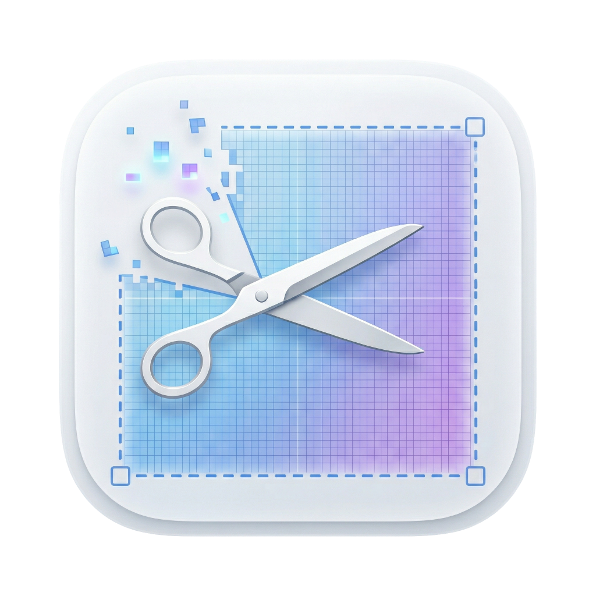

<div align="center">



<picture>
  <source media="(prefers-color-scheme: dark)" srcset="assets/banner-dark.png">
  <source media="(prefers-color-scheme: light)" srcset="assets/banner-light.png">
  
</picture>

### Lightning-fast screen capture for macOS.
**Snip it. Copy it. Paste it. Done.**

[](https://www.apple.com/macos/)
[](https://swift.org)
[](LICENSE)
[](https://github.com/GALAXYCODERS/FlowSnip/actions)
[](CONTRIBUTING.md)

<!-- TODO: Replace with an actual GIF/video of FlowSnip in action (800px wide recommended) -->
<!--  -->

<br>

[Download](#download) · [Features](#features) · [Usage](#usage) · [Contributing](CONTRIBUTING.md)

</div>

---

## Why FlowSnip?

macOS has built-in screenshot tools — so why FlowSnip?

| | macOS Screenshot (⌘⇧4) | FlowSnip (⌘⇧2) |
|---|---|---|
| **Output** | Saves a file to Desktop | Copies directly to clipboard |
| **Workflow** | Screenshot → Find file → Drag into app | Screenshot → ⌘V → Done |
| **Selection UI** | Basic crosshair | Liquid glass overlay with glow effects |
| **Feedback** | Camera shutter sound | Haptic feedback + animated toast |
| **Extra steps** | 0-2 clicks to reach clipboard | Zero — it's already there |

FlowSnip is built for people who screenshot to **paste**, not to **save**.

---

## Features

<table>
<tr>
<td width="50%">

**Instant Clipboard Capture**
Press `⌘ + Shift + 2` from anywhere — your selection goes straight to the clipboard. No files, no dialogs, just `⌘V` to paste.

</td>
<td width="50%">

**Liquid Glass Selection**
Beautiful frosted glass overlay with rounded corners, glow effects, and an inverted mask that puts your selection front and center.

</td>
</tr>
<tr>
<td>

**Multi-Monitor Support**
The overlay spans seamlessly across all connected displays. Works with any screen arrangement.

</td>
<td>

**Silent & Lightweight**
Runs as a menu bar agent — no Dock icon, no windows, no interruptions. ~2,300 lines of code, zero dependencies.

</td>
</tr>
<tr>
<td>

**Polished Details**
Haptic feedback on capture, animated "Copied!" toast, live size indicator during selection, smart corner radius scaling.

</td>
<td>

**Guided Onboarding**
First-launch wizard walks you through Accessibility and Screen Recording permissions step by step — no guesswork.

</td>
</tr>
</table>

---

## Download

### Direct (ZIP)

Download the latest `FlowSnip.zip` from the [Releases](../../releases) page, then run this in your Terminal:

```bash
cd ~/Downloads && \
unzip FlowSnip.zip && \
mv FlowSnip.app /Applications/ && \
xattr -dr com.apple.quarantine /Applications/FlowSnip.app && \
open /Applications/FlowSnip.app && \
echo "✓ FlowSnip installed and launched"
```

> FlowSnip is not notarized (no Apple Developer account). The `xattr` command removes the macOS quarantine flag — this is normal for apps distributed outside the App Store.

### Build from Source

**Prerequisites:** Xcode 15+ and macOS 13.0 (Ventura) or later.

```bash
git clone https://github.com/GALAXYCODERS/FlowSnip.git
cd FlowSnip
open FlowSnip.xcodeproj
```

1. Select the **FlowSnip** scheme and your Mac as the run destination
2. Press `⌘R` to build and run
3. Look for the crop icon in your **menu bar** (not the Dock)
4. Follow the onboarding wizard to grant permissions

---

## Usage

| Shortcut | Action |
|---|---|
| `⌘ + Shift + 2` | Start capture |
| Click + Drag | Select screen region |
| Release | Capture & copy to clipboard |
| `Esc` | Cancel capture |
| `⌘ + V` | Paste your capture anywhere |

**Three steps:** Press `⌘⇧2` → Drag to select → Release. Done — it's on your clipboard.

---

## System Requirements

- **macOS 13.0** (Ventura) or later
- **Accessibility** permission — for global keyboard shortcut detection
- **Screen Recording** permission — for capturing screen content

---

## Tech Stack

| | |
|---|---|
| **Language** | Swift 6 |
| **UI** | AppKit + SwiftUI |
| **Capture** | CoreGraphics · ScreenCaptureKit |
| **Keyboard** | Carbon Hot Keys + NSEvent Monitors |
| **Dependencies** | None — pure system frameworks |

<details>
<summary><strong>Architecture Overview</strong></summary>

```
FlowSnip/Sources/
├── main.swift                 # App entry point
├── AppDelegate.swift          # Lifecycle, menu bar, coordination
├── EventTapManager.swift      # Global shortcut (Carbon + NSEvent dual)
├── OverlayWindowManager.swift # Multi-screen overlay windows & toast
├── LiquidOverlayView.swift    # SwiftUI selection with drag gestures
├── CaptureEngine.swift        # Screenshot capture & clipboard write
├── OnboardingView.swift       # Permission setup wizard
└── ClipboardToastView.swift   # Animated success notification
```

</details>

---

## Contributing

Contributions are welcome! Check out the [Contributing Guide](CONTRIBUTING.md) to get started.

Please read our [Code of Conduct](CODE_OF_CONDUCT.md) before participating.

---

## License

FlowSnip is released under the [MIT License](LICENSE).

---

<div align="center">

Built by [Christian Homborg](https://github.com/GALAXYCODERS)

If you find FlowSnip useful, consider giving it a star — it helps others discover the project.

</div>
